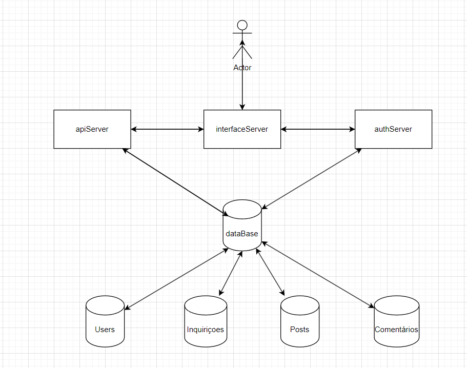

# EngWeb24-Proj

Trabalho Prático de EngWeb2024 realizado por :

- André Pimentel Filipe - A96890
- David da Silva Teixeira - A100554
- João Henrique Costa Ferreira - A96854
- João Manuel Novais da Silva - A91671

## Introdução

Este documento serve como relatório para o projeto da Unidade Curricular de Engenharia Web, do 3º ano da Licenciatura em Engenharia Informática.

Ao longo deste relatório vamos explicar o nosso raciocínio, as nossas interpretações e a nossa resolução do problema dado no enunciado.

O relatório está dividido em 4 partes, cada uma das pastas deste repositório representa uma divisão do trabalho.

- São elas respetivamente:
1. [Estrutura/Arquitetura da plataforma](https://github.com/jmns01/EngWeb24-Proj/blob/andre/arquitetura.png)
2. [Tratamento de dados](https://github.com/jmns01/EngWeb24-Proj/tree/main/data)
3. [API de dados](https://github.com/jmns01/EngWeb24-Proj/tree/main/apiServer)
4. [Front-end](https://github.com/jmns01/EngWeb24-Proj/tree/main/interfaceServer)
5. [Servidor de Autenticação](https://github.com/jmns01/EngWeb24-Proj/tree/main/authServer)

O tema escolhido pelo nosso grupo foi o [Inquirições de Génere](colocar link do git com o enunciado).

## Estrutura/Arquitetura da plataforma

Esta arquitetura é construída por 3 servidores: **interfaceServer**, **apiServer** e **authServer**. Cada um serve um propósito bem definido e a comunicação entre eles é fundamental para conceber a plataforma pretendida.

## [Tratamento de dados](https://github.com/jmns01/EngWeb24-Proj/tree/main/data)

### Script *csv_json_parser.py*

Recebendo o ficheiro de dados em formato [.csv](https://github.com/jmns01/EngWeb24-Proj/blob/main/data/PT-UM-ADB-DIO-MAB-006.CSV) teríamos não só de o tratar como passar para [.json](colocar o link do db.json) e para isso utilizamos uma ***[script](https://github.com/jmns01/EngWeb24-Proj/blob/main/data/csv_json_parser.py)*** escrita na linguagem *python*, há semelhança do que já tínhamos feito em aulas da UC.

### Script *analise.py*

O arquivo **analise.py** contém um conjunto de funções para analisar um arquivo JSON e extrair valores únicos. Abaixo está uma descrição detalhada de suas funcionalidades:
- São elas respetivamente:
1. make_hashable: Converte listas em tuplas de forma recursiva para garantir que sejam "hashable" (ou seja, que possam ser usadas em conjuntos e como chaves de dicionários).
2. list_unique_values: Lê um arquivo JSON, extrai valores únicos de cada campo do JSON e armazena esses valores únicos em um dicionário onde as chaves são os nomes dos campos e os valores são conjuntos de valores únicos.
3. save_unique_values_to_json: Guarda o dicionário de valores únicos em um novo arquivo JSON.

## [API de dados](https://github.com/jmns01/EngWeb24-Proj/tree/main/apiServer)

A resolução desta parte, à semelhança das outras, está de acordo com o feito nas aulas práticas. Sendo uma API de dados, serve principalmente para devolver os dados da base de dados de acordo com os vários critérios. Utilizando a base de dados guardada em mongoDB, utilizamos o módulo mongoose para conectarmo-nos à base de dados. De seguida, tratamos da criação dos [modelos](https://github.com/jmns01/EngWeb24-Proj/blob/main/apiServer/models/inquiricao.js) dos vários objetos da BD.

## [Front-end (InterfaceServer)](https://github.com/jmns01/EngWeb24-Proj/tree/main/interfaceServer)

O interfaceServer é o principal servidor na plataforma por ser o servidor que conecta todas as outras componentes e também por ser o servidor que comunica diretamente com o utilizador.

Este servidor trata de todos os pedidos do utilizador e usa como suporte os outros dois servidores (authServer e apiServer) para dar resposta aos pedidos do utilizador.

Mais concretamente, este servidor faz pedidos ao apiServer para obter informação sobre as inquirições, os comentários e posts. Faz pedidos ao authServer para obter informação sobre os utilizadores para puder fazer várias coisas como autenticar utilizadores, editar os perfis e ter níveis de acesso diferentes para cada utilizador (admin e default).

## [Servidor de Autenticação](https://github.com/jmns01/EngWeb24-Proj/tree/main/authServer)

O authServer é o servidor encarregado de administrar todas as informações sobre os utilizadores. A gestão dessas informações envolve: criar, editar, listar, desativar e ativar utilizadores. Para isso, foi criada uma coleção na base de dados para armazenar as informações dos diversos utilizadores.

Além disso, este servidor é responsável por gerar um JWT (Json Web Token) para cada utilizador que se autenticar com sucesso na plataforma. Este token é então enviado para o interfaceServer para que o cliente possa armazená-lo as suas cookies. Este token permite que todos os servidores verifiquem se um determinado utilizador está autenticado, além de conferir o nome de utilizador, nível de acesso e se está ativo (todos esses campos são armazenados no payload do token). Assim, a autenticação de utilizadores e os diferentes níveis de acesso são implementados.

Diferente do interfaceServer, este servidor não gera nenhum tipo de interface, apenas responde às solicitações deste servidor consultando o banco de dados.
